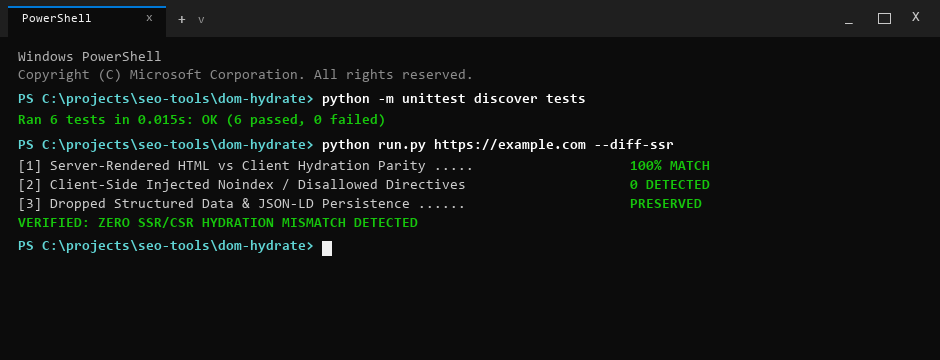

# DOMHydrate

> [!NOTE]
> **Public Architecture & Distribution Notice**: This repository provides the fully functional open-source CLI diff engine powered by Playwright headless Chromium. Continuous cloud profiling, batch scheduled crawls, and automated white-label client PDF reporting are hosted on the [WebAudits.pro](https://www.webaudits.pro) platform.


Forensic CSR vs. SSR SEO diff engine with headless Chromium DOM dumping.
Part of the [WebAudits.pro](https://webaudits.pro) technical intelligence platform.

> **Interactive Web Tool**: Run live SSR hydration and DOM parity audits directly in your browser at [webaudits.pro/tools/hydration-audit](https://webaudits.pro/tools/hydration-audit).



---

## Quickstart

Install in editable mode and audit SSR vs. CSR markup parity in seconds:

```bash
# Clone and install
git clone https://github.com/xcalibur73/dom-hydrate.git
cd dom-hydrate
pip install -r requirements.txt
playwright install chromium
pip install -e .

# Audit target URL
dom-hydrate https://example.com

# Emulate Googlebot smartphone crawler
dom-hydrate https://example.com --ua mobile
```

---

## What It Does & Why It Matters

DOMHydrate compares raw server-rendered HTML (SSR) against the fully hydrated browser Document Object Model (CSR) rendered by headless Chromium (`--headless=new --dump-dom`).

Modern JavaScript frameworks (Next.js, Nuxt, Remix, SvelteKit, Angular) stream an initial server HTML payload that client scripts then hydrate and mutate. Google Search Central documentation describes a two-wave indexing architecture where JavaScript execution is deferred until rendering resources become available, while many secondary crawlers and AI search bots index only the initial server payload.

DOMHydrate isolates discrepancies between what the server emits and what the client executes:
- **Directive Regressions:** Mismatches in `<title>`, `<meta name="description">`, `<link rel="canonical">`, and `<meta name="robots">`.
- **Client-Side `noindex` Injections:** High-severity alert when client JavaScript injects restrictive indexation directives post-mount.
- **Structured Data Drops:** Schema.org JSON-LD scripts present in server HTML but removed or malformed during client hydration.
- **Social Crawler Parity:** Detects Open Graph (`og:*`) and Twitter Card (`twitter:*`) tags populated only during client-side hydration, which cause blank previews on non-JavaScript social bots (Facebook, X, LinkedIn, Slack).
- **Link Graph Parity:** Internal links added, mutated, or removed by client scripts.
- **DOM Tree Expansion:** Quantifies node inflation between initial HTML and fully mounted layouts.

---

## Visual Diagnostic Workflow

```text
[Input Target URL]
        |
        +---> [1. Raw SSR Fetch] ---------> Server HTML: <title>Brand - Product</title>, 1 JSON-LD script
        |
        +---> [2. Headless Chromium CSR] -> Hydrated DOM: <title>Welcome to App</title>, 0 JSON-LD scripts
        |
        v
[3. Hydration Differential Isolated]
        - Structured Data Regression: Client root provider replaced innerHTML, dropping Schema.org block
        - Social Preview Blindspot: og:image injected via useEffect(), missing in raw HTML for Slack/LinkedIn bots
        |
        v
[4. Recommended Fix]
        - Move Schema.org JSON-LD generation to server component layout (app/layout.tsx)
        - Pre-render og:image in root server response metadata export
```

---

## Usage & CLI Options

```bash
# Audit a target URL in standard desktop mode
dom-hydrate https://webaudits.pro

# Emulate Googlebot smartphone crawler
dom-hydrate https://webaudits.pro --ua mobile

# Extend hydration buffer for heavy single-page applications (6,000ms)
dom-hydrate https://example.com --wait 6000

# Export machine-readable JSON for CI/CD deployment checks
dom-hydrate https://example.com --output json --save dom-audit.json

# Write a shareable HTML report for a client or teammate
dom-hydrate https://example.com --format html --save dom-audit.html

# Show the full forensic tables after the plain-language result
dom-hydrate https://example.com --audience expert --fix-plan

# Check installed version
dom-hydrate --version
```

---

## Example Output

```text
+-------------------------------------------------------------------------------+
| DOMHydrate: SSR vs CSR Hydration Parity Audit                                 |
| Target URL: https://webaudits.pro                                             |
| Hydration Parity Score: 100.0/100 (Grade: A)                                  |
| Mode: headless_chromium | SSR Nodes: 726 | CSR Nodes: 726 | Expansion: 0.0%    |
+-------------------------------------------------------------------------------+

Metadata & Directives Parity:
+--------------------+------------------------+------------------------+--------+
| Directive / Tag    | Server HTML (SSR)      | Hydrated DOM (CSR)     | Status |
+--------------------+------------------------+------------------------+--------+
| Title              | Web Audits Pro         | Web Audits Pro         | Match  |
| Canonical URL      | https://webaudits.pro/ | https://webaudits.pro/ | Match  |
| Meta Robots        | index, follow          | index, follow          | Match  |
| Schema.org Scripts | 2 blocks               | 2 blocks               | Match  |
| Internal Links     | 40 discovered          | 40 discovered          | Match  |
+--------------------+------------------------+------------------------+--------+

Hydration Verdict: Clean Parity - zero client-side directive drift detected.
```

---

## Architecture

```text
[Target URL]
     |
     +---> [HTTP Fetcher] --------------> Raw SSR HTML --------+
     |                                                         |
     +---> [Headless Chromium (--dump-dom)] -> Hydrated CSR DOM +
                                                               |
                                                               v
                                                      [DOM Diff Engine]
                                                               |
                     +-----------------------------------------+-----------------------------------------+
                     |                                         |                                         |
                     v                                         v                                         v
            [Metadata & Directives]                   [Schema.org Blocks]                       [Link Graph & Nodes]
```

- `fetcher.py`: Performs raw HTTP GET request with crawler User-Agent headers, capturing server response body, TTFB, and response headers.
- `renderer.py`: Launches headless Chromium with `--headless=new`, waits for network idle and configurable hydration buffer, and extracts serialized DOM via `--dump-dom`.
- `diff_engine.py`: Normalizes and diffs metadata, Schema.org entities, internal anchor elements, and DOM node counts.
- `report_generator.py`: Generates Rich terminal tables, Markdown documentation, and JSON CI/CD artifacts.

---

## Standards & Heuristics

DOMHydrate separates web standards and documented crawler behavior from project-derived evaluation heuristics:

| Metric / Check | Classification | Authority / Basis |
|:---|:---|:---|
| HTML5 DOM Serialization | Web Standard | W3C DOM Parsing & Serialization |
| 2-Wave JavaScript Indexing | Search Architecture | Google Search Central Technical Documentation |
| Robots Meta Directives | Web Standard | RFC 9309 / Search Engine Specifications |
| DOM Node Expansion Rate | Project-Derived Heuristic | Structural ratio of CSR to SSR node counts |
| Hydration Parity Score | Project-Derived Heuristic | Weighted evaluation across metadata, schema, and links |

---

## Limitations

- **Chromium Dependency:** Requires Google Chrome or Chromium installed on the host system or container environment.
- **Hydration Wait Buffer:** Asynchronous components requiring user interactions (click-to-load, scroll-to-reveal) are not captured by initial idle buffers.
- **Authenticated Views:** Designed for publicly accessible crawlable URLs; pages requiring login sessions or CAPTCHA solves must be inspected via pre-authenticated cookies.

---

## Testing & CI

```bash
# Run unit tests
python -m unittest discover -s tests

# Output
# Ran 3 tests in 0.002s
# OK
```

Continuous integration runs automatically across Ubuntu and Windows runners on every commit via GitHub Actions.

---

## License & Commercial Restrictions

Published under the **PolyForm Noncommercial License 1.0.0**.
- **Personal & Educational**: Free to view, study, evaluate architecture, and run local personal tests. Full developer credit retained by [xcalibur73](https://github.com/xcalibur73).
- **Commercial & Agency Use**: Commercial auditing, SaaS re-hosting, embedding algorithms into third-party software, or commercial client deliverables require an enterprise commercial license.
- **Enterprise Licensing**: Contact [sfs@webaudits.pro](mailto:sfs@webaudits.pro) or visit [webaudits.pro](https://www.webaudits.pro).
